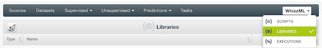
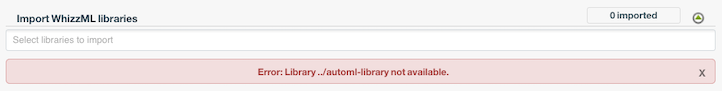

# AutoML: BigML Automated Machine Learning

In this repository, you can find a [`WhizzML Script`](./automl-script)
and a [`WhizzML Library`](./automl-library) to perform **Automated
Machine Learning** within BigML.

The [script](./automl-script) will execute, from a given set of
train/validation/test datasets, the three main stages in an Automated
Machine Learning pipeline: Feature Generation, Feature Selection and
Model Selection. The [library](./automl-library) contains some
lower-level functions to abstract away the complexity from the main
script.

## How to install

AutoML [`WhizzML Script`](./automl-script) imports a [`WhizzML
Library`](./automl-library), so the installation is a litle bit
different to other WhizzML scripts. You can still install it from the
Dashboard but you will need to perform an additional step.

### Using the Dashboard - 2 steps

Firstly, you should install the library. Open the WhizzML Libraries
view, as shown in the image, and import the library from Github, as
you would do with a WhizzML Script, using [the link to the library
](./automl-library)

Then, import the [`WhizzML Script`](./automl-script) from Github as
you would do with other WhizzML scripts, using [the link to the
script](./automl-script)

You may see the following error

In that case, you will have to find, in the selector, the library you
uploaded previously. After selecting it the error will disappear.

After these steps, you will be able to import the script correctly into your
BigML account.

### Using BigMLer - 1 step
If you have [bigmler](https://bigmler.readthedocs.io/en/latest/) and
`make` installed in your system, just check out the [WhizzML examples
repository](https://github.com/whizzml/examples/) and, at its [top
level directory](https://github.com/whizzml/examples/), issue the
command:

    make compile PKG=automl

That will create all necessary library and script resources for you,
and clean up any previous installations.  Please, make sure to execute
the `make` command above in the repository's top level directory,
*not* in [automl](./).

If `make` is not available in your system, you can install the library
and the script simply with this command (again, at the repository's
top level):

     bigmler whizzml --package-dir=automl

See also [the top-level readme](../readme.md) for general information
on installing packages in this repository.

## How to execute

To create a new execution of the AutoML, please read the [script
readme](./automl-script).
