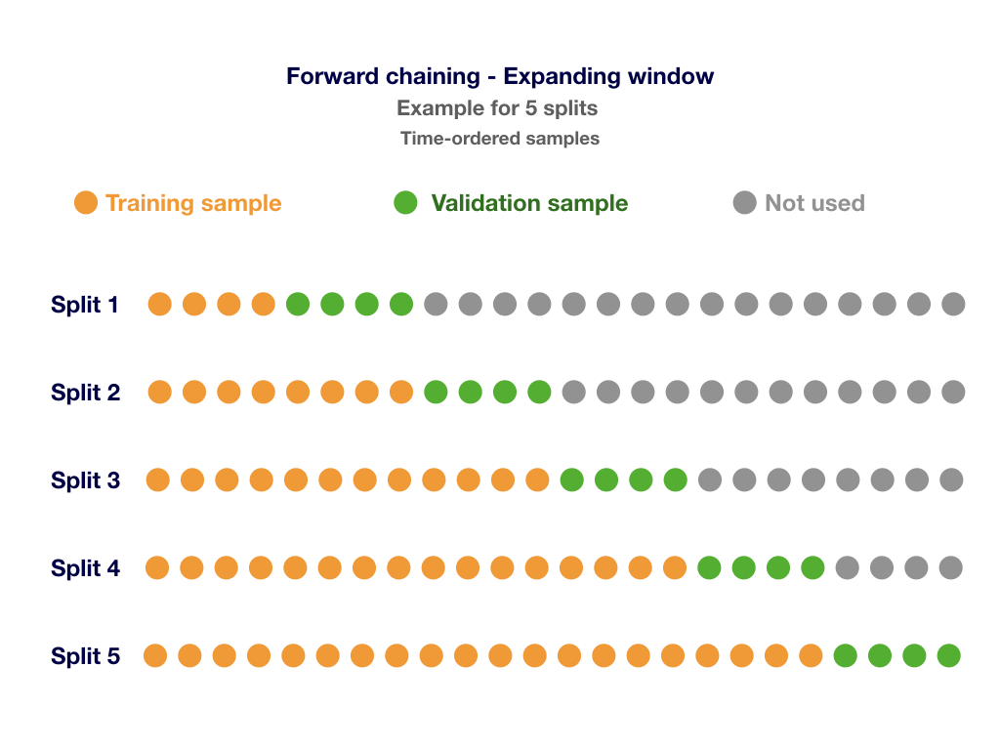
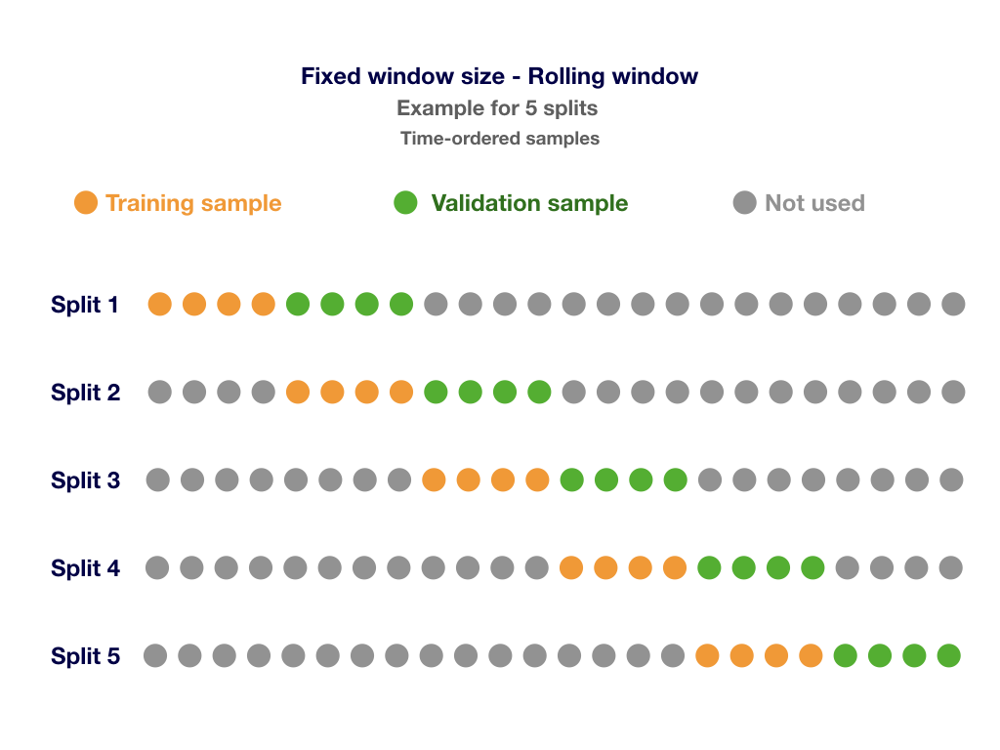

# Time-Aware Cross-Validation

In this package you'll find a script implementing a modified version
of the Cross-Validation technique that is able to deal with
**time dependent data**.

The *i.i.d.* (identically distributed independence) assumption does
not hold well to time dependent data. There is an implicit dependence
on previous observations, so the value of the objective field at a
given time is related to the values at previous (and future) times.
Traditional Cross-Validation, which performs random splits, ignores
this, resulting in serious underestimation of predictive error.

**Time-Aware Cross-Validation** techniques, also known as *Block
Cross-Validation*, divide the dataset into train and validation folds
ensuring that the validation set is always ahead of the training one.

This script offers two kinds of Time-Aware Cross Validation
techniques: **Forward Chaining** and **Fixed Window**:

- **Forward Chaining** uses an expanding window meaning that, on
    each iteration, a new block of samples will be added to the
    training data.
- **Fixed Window** uses a window with fixed size that slides over
    all the samples.

The following images will help you to understand both techniques:





**IMPORTANT**: Remember that the instances in your dataset should be
chronologically ordered before applying this script.

The inputs for the script are:
* `dataset-id`: (dataset-id) Original training dataset
* `n-splits`: (number) Number of splitting iterations in the
  cross-validator
* `fixed-window-size?`: (boolan) If `true`, the **Fixed Window**
  method, with a rolling window will be used instead of the **Forward
  Chaning** one. `false` by default
* `model-type`: (string) Type of supervised model that shuld be
  created. Allowed values are ``model``, ``ensemble``,
  ``linearregression``, ``logisticregression``
  ``deepnet`` and ``optiml``. ``ensemble`` is used by default.
* ``model-params``: (map) Additional creation parameters for
  supervised models. Empty map by default.
* ``delete-resources``: (boolean): Whether to delete intermediate
  resources. ``false`` by default.


The **outputs** for the script are:
* `cv-evaluation`: (evaluation-id) Evaluation resource with aggregated
  results from all the splits.


## Tests

The `test` directory contains a shell script named `test.sh`
which uses `BigMLer` to perform a basic test of the WhizzML code. To run the
test:

- BigMLer must be installed. For instructions to install BigMLer
please refer to the [BigMLer
documentation](http://bigmler.readthedocs.io/en/latest/#bigmler-installation).
- Your credentials must be set as environment variables. Please refer
to the [BigML
Authentication](http://bigmler.readthedocs.io/en/latest/#bigml-authentication)
section of docs for details.

Once the setup is complete, go to the test directory and run the shell script

```bash
    cd test
    ./test.sh
```
